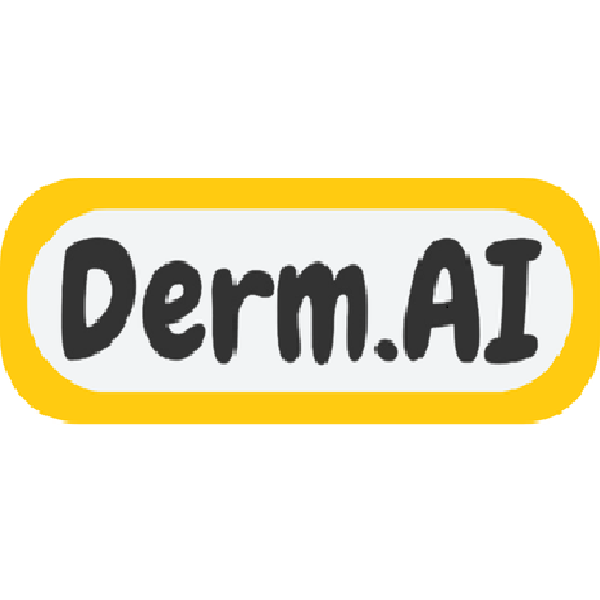

# Derm.AI Machine Learning
 <br>
|          Nama         | Bangkit-ID |       Path       |
|:---------------------:|:----------:|:----------------:|
|  I Gusti Agung Krisna Satya Wikrama  |  M007D4KY1724  | Machine Learning |
|  Bima Bayu Putra  |  M007D4KY1759  | Machine Learning |
|  Ali Siddiq Al Farizi Siregar  |  M298D4KY1969  | Machine Learning |

# What is Dermatologist AI? 
Dermatalogist AI or Derm.AI is an app to assist people in taking care of their skin problem conviniently by assessing a picture sent by the user and then give the appropriate solution for their personal skin problems.

# Models
Derm.AI has only 1 model, the model is used to detect the existing skin problem in a image sent by the user. <br>


# Dataset Link
https://drive.google.com/drive/folders/1FBCT_kKAnNKb9zt_Q9ZO-CPiCKvviChR?usp=drive_link

### Requirements
- Tensorflow 2.15.0
- Numpy
- Matplotlib
- os
- cv2 
- PIL
- tensorflowjs
- tensorflowlite

### Running the model
1. Clone the repository
```bash
git clone https://github.com/C241-PS405/derm-ai-ml.git
```
2. Install the required dependencies
```bash
pip install tensorflow==2.15.0 numpy matplotlib cv2 pillow
```
3. Open the object_detection_model_builder.ipynb
4. Run the notebook to train and evaluate the model
5. The trained model will be saved automatically in the specified path 
